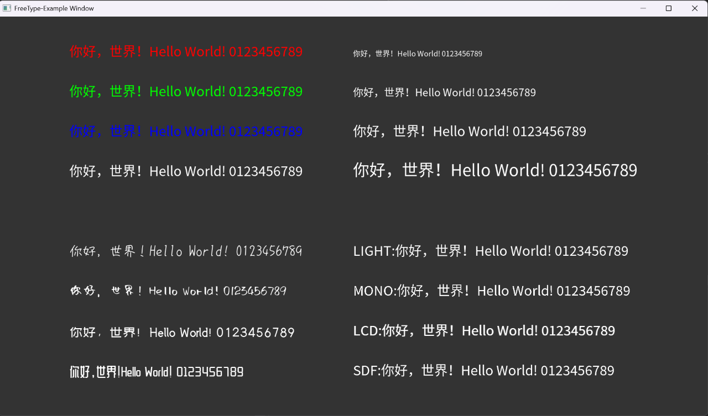

# FreeType-Example
这是一个基于 OpenGL 和 FreeType 的简单 C++ 字体渲染示例，利用 FreeType 解析字体文件（如 .ttf），将字符转换为位图纹理，并通过 OpenGL 着色器渲染到屏幕上，并支持 NORMAL、LIGHT、MONO、LCD、SDF 字体渲染模式。

测试字体来源：https://freefonts.cn

## 环境
**Cmake ：** 3.12以上 

## 使用
**Windows**
```    
    cd /projectPath
    cmake -B ./build
```
## 渲染示例


